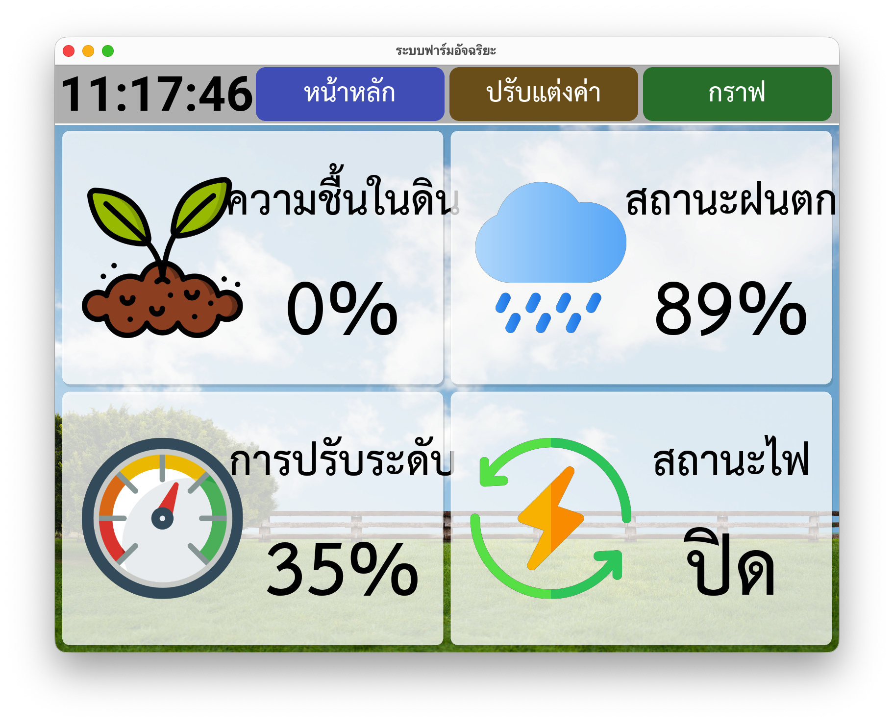
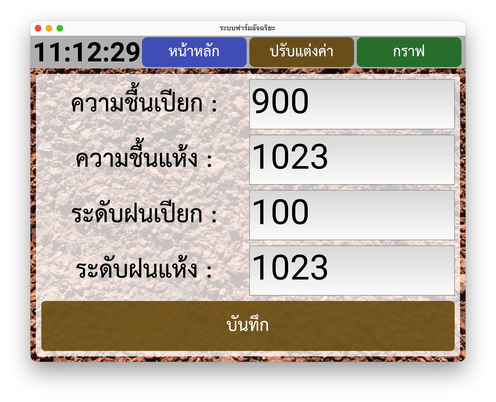
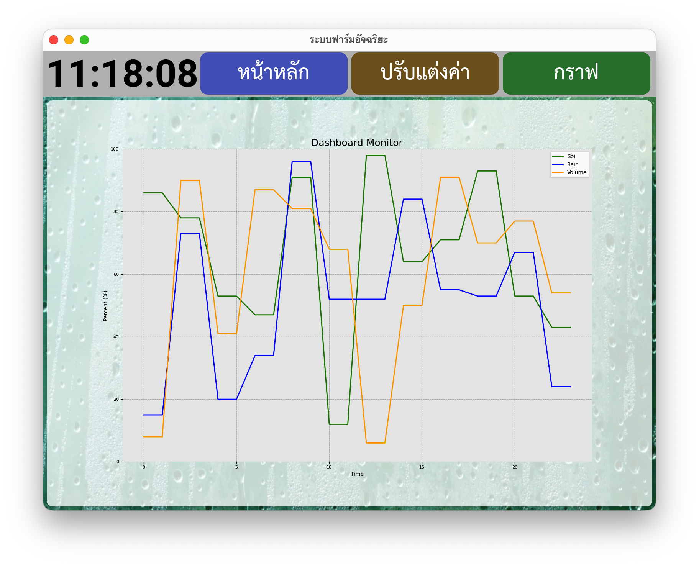

# SmartFarm Basic Dashboard (Kivy)



A simple training/demo project that reads sensor values (from Arduino over serial) and shows them on a Kivy dashboard UI.

Target device: **Raspberry Pi 5**. It can also run on a PC for UI testing/demo purposes.


## Screenshots

<p align="center">
	
	
</p>

## Features

- Kivy UI with 3 screens: Home, Config, Dashboard chart
- Reads Arduino serial data: soil / rain / VR (0–1023)
- Converts raw ADC values to percent using calibration thresholds in `config.ini`
- Live time display + rolling matplotlib graph (via Kivy Garden)

## Project Files

- `demo.py` — main Kivy application
- `demo.kv` — UI layout
- `config.ini` — calibration thresholds (soil/rain wet/dry)
- `demo.ino` — Arduino sketch that reads analog sensors and sends serial
- `demo wiring.txt` — quick wiring notes

## Quick Start (Python / Virtual Environment)

### 1) Create and activate a venv

macOS / Linux:

```bash
python3 -m venv .venv
source .venv/bin/activate
python -m pip install --upgrade pip
```

Windows (PowerShell):

```powershell
py -m venv .venv
.\.venv\Scripts\Activate.ps1
python -m pip install --upgrade pip
```

### 2) Install dependencies

```bash
python -m pip install -r requirements.txt
```

If `kivy_garden.matplotlib` is not found on your platform, install it explicitly:

```bash
python -m pip install kivy-garden.matplotlib
```

### 3) Run the app

```bash
python demo.py
```

## Running on PC (without GPIO)

GPIO control is intended for Raspberry Pi and typically uses the `gpiozero` library.
To run on a PC, comment out (or keep commented) the `gpiozero` import and any GPIO-related setup/functions in `demo.py`.

In this repo, the GPIO-related lines are already commented (look for `gpiozero`, `Button`, `OutputDevice`, and `toggle_power`).

## Arduino / Serial Input

The app expects the Arduino to send lines like:

```text
soil:NNN;rain:NNN;vr:NNN
```

The default serial port in `demo.py` is set to `/dev/ttyACM0` (common on Raspberry Pi/Linux).

- On macOS it may look like `/dev/cu.usbmodemXXXX` or `/dev/cu.usbserial-XXXX`
- On Windows it will be `COM3`, `COM4`, etc.

Update the port string in `demo.py` to match your machine.

## Calibration (`config.ini`)

`config.ini` stores the wet/dry thresholds used to map raw ADC readings to percent.
You can change values in the app’s “Config” screen; it will write updates back to `config.ini`.

## Notes

- Training/demo project only (not a production/official dashboard).
- Fonts `THSarabunNew.ttf` / `THSarabunNew Bold.ttf` are bundled and registered in the app.

## Acknowledgements

- Author/Trainer: Mr. Patchara Paungsiri
- College of Computing, Khon Kaen University – SmartFarm training program. Educational use only.
